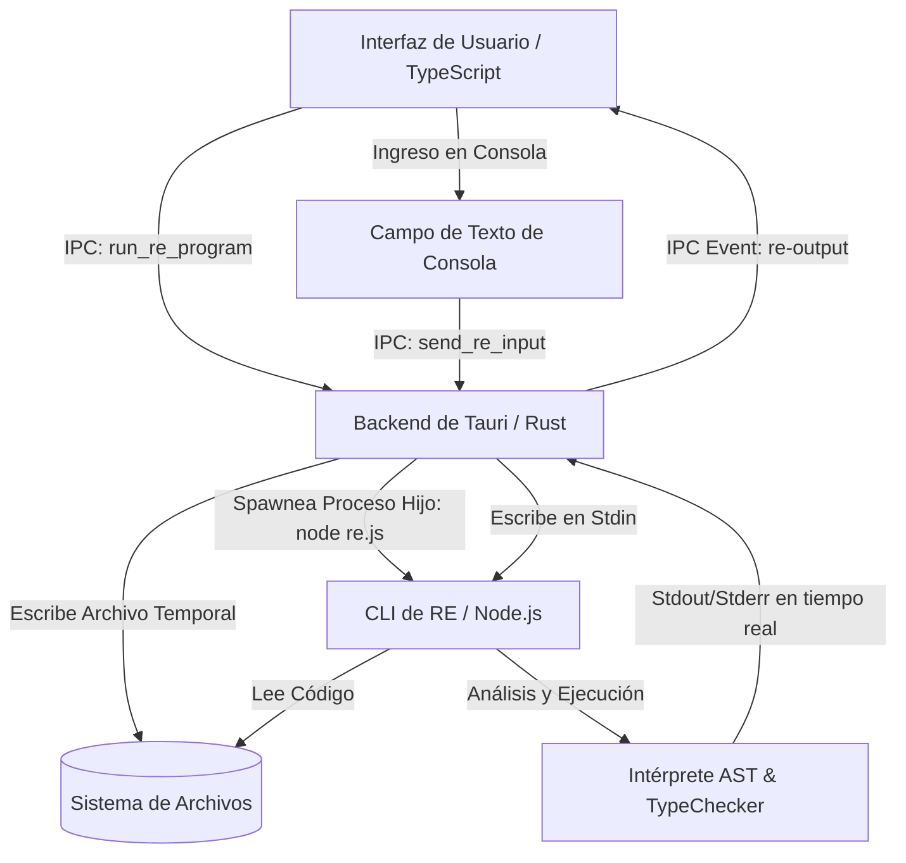

# Logos: Entorno de Desarrollo Integrado y Motor del Lenguaje RE

Logos es un ecosistema de desarrollo integrado de nivel educativo y profesional. Combina el motor de ejecución e interpretación de un lenguaje estructurado con tipado estático fuerte (el lenguaje RE) y un editor visual de diagramas de flujo interactivo (Logos IDE). Este proyecto permite crear, ejecutar y analizar código mediante dos interfaces complementarias y sincronizadas en tiempo real: un editor de código avanzado y un lienzo de diagramas visuales.

El ecosistema está diseñado bajo principios de modularidad, alto rendimiento y extensibilidad, estructurándose en dos proyectos principales: el motor del lenguaje RE (desarrollado con TypeScript y ANTLR4) y la interfaz Logos Editor (desarrollada en Rust con Tauri v2 y TypeScript con Vite).

---

## Estructura del Repositorio

La raíz del proyecto organiza las diferentes partes de la solución de la siguiente manera:

*   **Logos-Front**: Carpeta del cliente y editor visual. Implementado con Tauri v2, Rust en el backend y TypeScript puro con Vite en el frontend.
*   **RE**: Carpeta del motor del compilador, intérprete, servidor de lenguaje (LSP) y CLI para el lenguaje RE, desarrollado en Node.js y TypeScript.
*   **LICENSE**: Archivo de licencia del proyecto (MIT License por Diego Zarate).
*   **plan_de_integracion.txt** y **progreso_integracion.txt**: Documentación técnica del proceso de integración entre el compilador y la interfaz de usuario.

---

## 1. El Lenguaje de Programación RE

RE es un lenguaje de programación interpretado diseñado con fines educativos y de prototipado rápido. Su sintaxis combina la limpieza y legibilidad de Python con la seguridad, estructura y el tipado fuerte y estático de lenguajes como C# o Java. 

### Características Clave del Motor RE

*   **Sistema de Tipos Estático y Fuerte**: Un analizador estático (TypeChecker) evalúa el código antes de la ejecución, detectando incompatibilidades de tipos, llamadas a funciones con firmas incorrectas y variables no declaradas.
*   **Tipos de Datos Soportados**:
    *   **Primitivos**: int (enteros), double (números con punto flotante), string (cadenas de texto), bool (booleanos: true/false).
    *   **Tipado Dinámico e Inferencia**: La palabra clave `var` permite asignaciones flexibles que se infieren estáticamente según la expresión asignada.
*   **Colecciones de Datos Genéricas**:
    *   `list<T>`: Listas dinámicas con operaciones nativas como `.add(valor)`, `.remove(indice)`, `.get(indice)` y `.size()`.
    *   `array<T>`: Arreglos de tamaño fijo optimizados en memoria, con acceso mediante brackets `arr[i]` o `.get(indice)`.
    *   `queue<T>`: Colas dedicadas que implementan el patrón First-In, First-Out (FIFO) mediante `.enqueue(valor)`, `.dequeue()` y `.size()`.
    *   `stack<T>`: Pilas dedicadas que implementan el patrón Last-In, First-Out (LIFO) mediante `.push(valor)`, `.pop()` y `.size()`.
*   **Control de Flujo Avanzado**:
    *   Estructuras condicionales estándar: `if`, `else if` y `else`.
    *   Bucles: `while` y `do-while`.
    *   Bucle iterador `for-in` (`for x in coleccion`): Soporta iteración de colecciones tipadas (infiriendo el tipo de la variable iteradora) o rangos numéricos estructurados (ej. `for i in 1..10`).
*   **Funciones con Ámbito Aislado**:
    *   Permiten parámetros tipados y tipos de retorno específicos (incluyendo retorno implícito o explícito de valores).
    *   Poseen pre-registro automático, por lo que las funciones se pueden invocar incluso si están declaradas después de su uso en el archivo.
*   **Métodos Integrados para Cadenas**:
    *   Los strings cuentan con funciones miembro de fábrica: `.upper()`, `.lower()`, `.contains(subcadena)`, `.substring(inicio, fin)` y `.size()`.
*   **Funciones de Conversión de Tipos (Castings)**:
    *   `to_int(valor)`, `to_str(valor)`, `to_double(valor)`.
*   **Entrada y Salida Síncrona Multiplataforma**:
    *   `print(expresion)`: Imprime texto y representaciones textuales de colecciones en la terminal.
    *   `input(prompt)`: Pausa el hilo de ejecución para recibir datos del usuario desde la consola estándar (stdin), empleando lectura síncrona nativa de Node.js a nivel de archivo.

---

## 2. Arquitectura de Logos IDE

Logos IDE es la interfaz de usuario de escritorio que sirve como entorno de desarrollo unificado. Utiliza la potencia nativa de Rust a través de Tauri v2 y la interactividad ágil de TypeScript en el frontend.

### Componentes de la Interfaz

*   **Editor de Código Avanzado**: Integra Ace Editor configurado en modo oscuro (one_dark) y con la tipografía Space Mono. Cuenta con un resaltador de sintaxis personalizado para las palabras clave del lenguaje RE.
*   **Consola de Salida Interactiva**: Muestra la salida del programa en tiempo real. Cuando el intérprete evalúa la función `input()`, la consola detiene la ejecución, abre una barra de escritura para el usuario y transmite el dato ingresado al flujo de entrada estándar (stdin) del proceso del compilador.
*   **Lienzo Visual de Flujos (Blueprint Editor)**: Permite estructurar y editar programas mediante nodos conectados que representan elementos lógicos:
    *   **Inicio/Fin** (Nodos óvalo con color primario)
    *   **Proceso** (Nodos rectangulares para declaraciones y operaciones de asignación)
    *   **Decisión** (Nodos diamante para estructuras condicionales `if-else`)
    *   **Entrada/Salida** (Nodos paralelogramo para operaciones de `input` y `print`)
    *   **Dato** (Nodos redondeados que representan parámetros)
    *   **Terminal/Error** (Nodos óvalo con color de alerta de error)
*   **Sincronización Bidireccional**:
    *   **De Diagrama a Código**: El IDE recorre el grafo del lienzo mediante un algoritmo BFS (Breadth-First Search) y genera el archivo de código RE equivalente.
    *   **De Código a Diagrama**: Un analizador sintáctico en el frontend lee el código RE línea a línea e interactúa con el canvas para reconstruir los nodos y las conexiones lógicas del diagrama de flujo.
*   **Explorador de Archivos Seguro**: Implementa comandos IPC desde el backend de Rust para examinar directorios, abrir archivos y guardar cambios, eliminando el uso de APIs web locales inseguras.
*   **Analizador de Errores en Tiempo Real (Linting)**: Un gancho programado con un retraso (debounce) de 400 milisegundos tras las modificaciones del usuario en el editor ejecuta de forma no bloqueante el analizador estático de RE. Si encuentra fallos (de sintaxis, tipos o léxicos), parsea el resultado utilizando expresiones regulares e introduce anotaciones visuales y subrayados ondulados rojos (squiggly lines) en el gutter y en las líneas del editor Ace.

---

## 3. Flujo de Comunicación e Integración Técnica

El siguiente diagrama detalla cómo interactúan los distintos componentes de Logos IDE y el motor del lenguaje RE para llevar a cabo la ejecución y el análisis estático de código:



Cuando se solicita el análisis estático para el linter (Hito 4 de la integración):
1. El editor de código registra un cambio de texto.
2. Al expirar un retraso de 400ms sin nuevos cambios, se dispara un comando `check_re_code`.
3. Rust escribe el código actual en un archivo temporal con extensión `.re`.
4. Rust invoca el proceso `node RE/dist/compiler.cli/re.js temporal.re --check`.
5. El compilador de RE ejecuta la validación sintáctica y el TypeChecker, imprimiendo los errores en formato estructurado: `[SyntaxError] Línea L:C mensaje` o `[TypeCheckError] en Línea L, Columna C: mensaje`.
6. Rust recoge la salida de forma síncrona, y la retorna al frontend.
7. El editor de código parsea el texto y pinta las alertas rojas directamente en la pantalla de edición del usuario.

---

## 4. Ejemplos de Programación en RE

A continuación se muestran ejemplos prácticos del lenguaje RE que ilustran su expresividad y el control estricto de tipos.

### Ejemplo 1: Entrada y Salida Estándar

```re
program EjemploSaludo {
    string nombre = input("Por favor, introduce tu nombre: ");
    print("¡Bienvenido al entorno Logos, " + nombre + "!");
}
```

### Ejemplo 2: Seguridad y Comprobación de Tipos (TypeChecker)

El compilador de RE detectará errores antes de que se intente ejecutar el programa si existen discrepancias entre los tipos declarados:

```re
program TiposSeguros {
    int factor = 10;
    double precision = 4.5;
    
    // Este cálculo es válido. El motor realiza conversiones implícitas permitidas:
    double total = factor * precision;
    
    // El siguiente código provocaría un error en el TypeChecker:
    // string mensaje = "El valor es: " + factor;
    // Debes convertir explícitamente:
    string mensaje = "El valor es: " + to_str(factor);
    
    print(mensaje);
}
```

### Ejemplo 3: Listas, Colas y Bucles Iteradores

El bucle `for-in` infiere automáticamente el tipo del elemento interno a partir de la colección asignada:

```re
program ColeccionesYIteracion {
    // Declaración e inicialización de una cola de números enteros
    queue<int> turnos = [100, 101, 102];
    turnos.enqueue(103);
    
    print("Elementos en la cola de turnos:");
    // La variable 't' es inferida de forma estática como de tipo 'int'
    for t in turnos {
        print("Turno número: " + to_str(t));
    }
    
    // Desencolar elementos
    int atendido = turnos.dequeue();
    print("Siguiente a atender: " + to_str(atendido));
    print("Elementos restantes: " + to_str(turnos.size()));
}
```

### Ejemplo 4: Funciones con Ámbito de Variables

Las funciones deben declararse al inicio del bloque del programa y definir sus firmas:

```re
program OperacionesMatematicas {
    // Definición de la función antes del cuerpo principal del programa
    double calcularDescuento(double subtotal, double porcentaje) {
        double descuento = subtotal * (porcentaje / 100.0);
        return subtotal - descuento;
    }
    
    double precioOriginal = 250.0;
    double tasaDescuento = 15.0;
    
    double precioFinal = calcularDescuento(precioOriginal, tasaDescuento);
    print("Precio final con descuento: " + to_str(precioFinal));
}
```

---

## 5. Requisitos de Instalación del Entorno

Para compilar, ejecutar y editar archivos en el proyecto Logos y RE, se requieren las siguientes tecnologías base en el sistema:

1.  **Node.js**: Versión 18.0 o superior instalada de forma global.
2.  **Rust y Cargo**: Kit de herramientas de desarrollo Rust (versión estable recomendada) para compilar el backend del Logos Editor.
3.  **Tauri CLI**: Necesario para el empaquetado del cliente ligero.
4.  **Vite**: El empaquetador del frontend para desarrollo web en TypeScript.

### Instalación de los Ejecutables del Lenguaje RE

El motor de RE cuenta con scripts automatizados de compilación e instalación global para añadir la utilidad de compilador (`re`) y servidor de lenguaje (`re-lsp`) al PATH del sistema operativo.

#### En Sistemas Linux y macOS
Abre un terminal en el directorio `/RE` del proyecto y ejecuta:
```bash
chmod +x install.sh
./install.sh
```
El script compilará el código de TypeScript de RE y establecerá enlaces simbólicos en `/usr/local/bin` para exponer el compilador de forma global.

#### En Sistemas Windows
Abre un terminal de **PowerShell con privilegios de Administrador** en el directorio `/RE` y ejecuta:
```powershell
Set-ExecutionPolicy Bypass -Scope Process -Force
.\install.ps1
```
Una vez que el script de instalación finalice, recuerda cerrar y volver a abrir la consola de comandos para que la actualización del PATH surta efecto.

---

## 6. Integración en Editores de Texto Externos (LSP)

El motor de RE incluye un servidor que implementa el protocolo LSP (`re-lsp`). Esto permite la autocompletación de funciones, ayuda contextual y detección de errores en tiempo real en editores externos.

### Visual Studio Code
Para instalar el cliente de VS Code de RE, debes copiar la carpeta de extensión a la ruta de extensiones del usuario:
*   **Linux y macOS**: Copiar `RE/editors/vscode` a `~/.vscode/extensions/re-vscode`
*   **Windows**: Copiar `RE/editors/vscode` a `%USERPROFILE%\.vscode\extensions\re-vscode`

### Neovim (v0.8+)
Añade el siguiente bloque de configuración en tu archivo de inicio `init.lua`:
```lua
local lspconfig = require('lspconfig')
local configs = require('lspconfig.configs')

if not configs.re_lsp then
  configs.re_lsp = {
    default_config = {
      cmd = { 're-lsp' },
      filetypes = { 're' },
      root_dir = lspconfig.util.find_git_ancestor,
      single_file_support = true,
      settings = {},
    },
  }
end

lspconfig.re_lsp.setup{}
```

### Sublime Text (Sublime LSP Plugin)
1. Instala el componente `LSP` desde el gestor Package Control.
2. Abre la configuración de LSP (`Preferences > Package Settings > LSP > Settings`) y agrega en la propiedad `clients` la siguiente entrada:
```json
{
  "clients": {
    "re-lsp": {
      "enabled": true,
      "command": ["re-lsp"],
      "selector": "source.re"
    }
  }
}
```

### Helix Editor
Inserta la siguiente definición en tu archivo global `~/.config/helix/languages.toml`:
```toml
[[language]]
name = "re"
scope = "source.re"
file-types = ["re"]
roots = [".git"]
language-servers = [ "re-lsp" ]

[language-server.re-lsp]
command = "re-lsp"
```

---

## 7. Ejecución de Logos IDE (Entorno Gráfico)

Una vez que tengas instalado el motor de RE y desees iniciar la interfaz visual integrada de Logos, sigue los siguientes pasos:

1.  Navega al directorio `/Logos-Front` desde una consola de comandos.
2.  Instala las dependencias de Node.js necesarias para el compilador del frontend:
    ```bash
    npm install
    ```
3.  Inicia el entorno de desarrollo con soporte de Tauri ejecutando:
    ```bash
    npm run tauri dev
    ```
    Tauri compilará el código del backend de Rust y levantará la ventana de escritorio con el editor Ace, la consola de salida y el lienzo del Blueprint Editor.
4.  Si requieres empaquetar la aplicación de escritorio en un instalador optimizado para producción, ejecuta:
    ```bash
    npm run tauri build
    ```

---

## Licencia

Este proyecto está bajo los términos de la Licencia MIT. Consulta el archivo LICENSE en la raíz del repositorio para obtener más información.